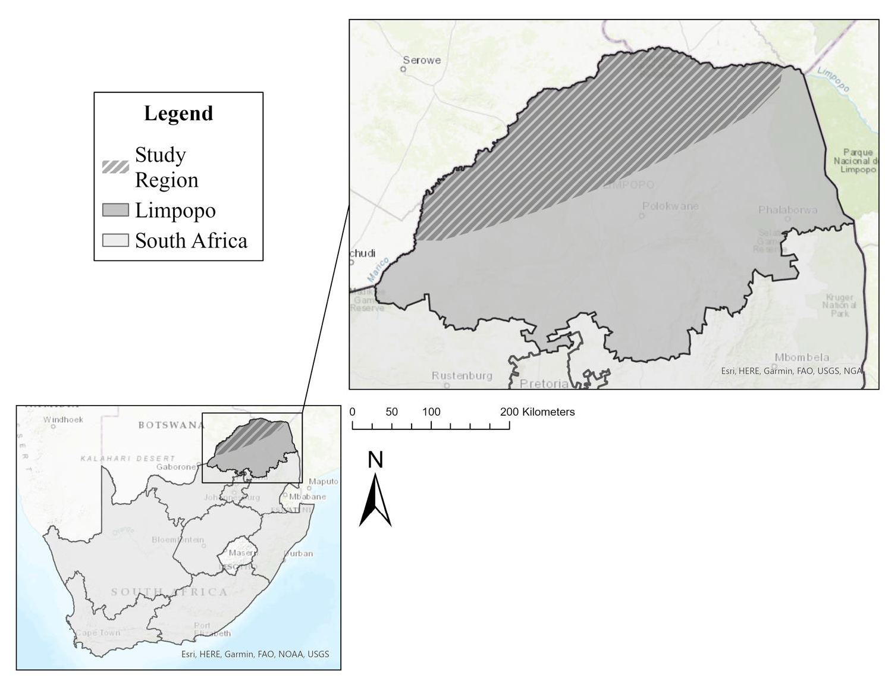
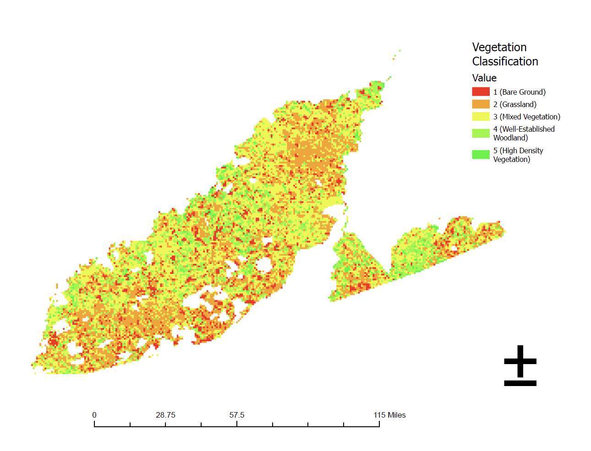

# Landscape Fragmentation and Conservation Strategies for Cheetahs in Northern South Africa

This repository contains the LaTeX manuscript and supporting figures for a paper on cheetah habitat suitability analysis using vegetation classification and spatial data in Limpopo, South Africa.

This project uses GIS and remote sensing to evaluate habitat characteristics relevant to cheetah distribution.

This study analyzes vegetation structure and spatial patterns to assess habitat suitability for cheetahs in Limpopo. NDVI-based classification and GIS analysis were used to identify areas with characteristics associated with suitable habitat.

## Repository structure

- `manuscript/main.tex` — main LaTeX manuscript
  
- Study Region: 
  
- Vegetation Classification: 

## Notes

The manuscript uses an inline bibliography in `main.tex`, so no separate `.bib` file is required for compilation in its current form.

## Suggested workflow

Clone the repository, compile `manuscript/main.tex`, make edits locally, then commit and push changes back to GitHub.

